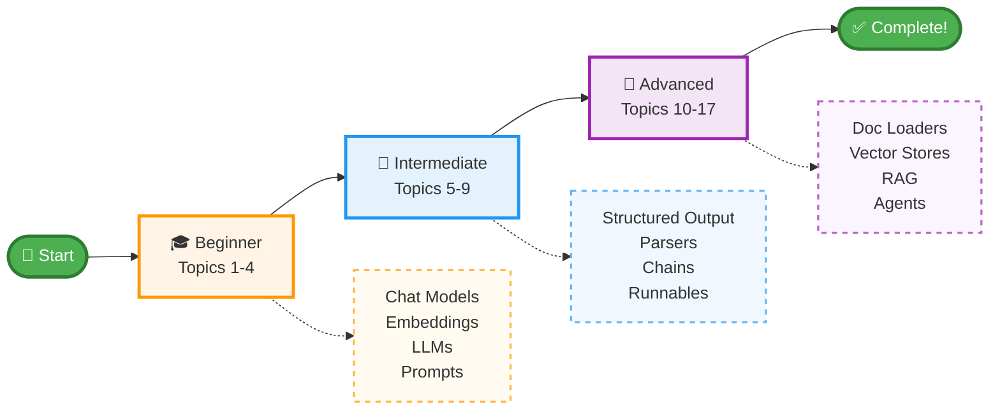

# 🦜🔗 LangChain Learning Repository

A comprehensive collection of Jupyter notebooks and Python scripts demonstrating the core concepts and components of LangChain, organized in a structured learning path from basics to advanced topics.

---

## 📚 Table of Contents

- [Repository Structure](#repository-structure)
- [Prerequisites](#prerequisites)
- [Installation](#installation)
- [Learning Path](#learning-path)
- [Usage](#usage)
- [Resources](#resources)
- [Acknowledgments](#acknowledgments)

---

## 📂 Repository Structure

This repository serves as a hands-on learning resource for LangChain, a framework for developing applications powered by language models. Each folder contains practical examples and implementations that progress from fundamental concepts to advanced use cases.


```
LangChain/
├── 1_Chat Models/           # Working with chat-based language models
├── 2_Embedding Models/      # Text embeddings and vector representations
├── 3_LLMs/                  # Large Language Model integrations
├── 4_Prompts/               # Prompt engineering and templates
├── 5_Structured Output/     # Parsing and structuring LLM outputs
├── 6_Output Parsers/        # Different output parsing strategies
├── 7_Chains/                # Combining components into chains
├── 8_Runnables/             # LangChain Expression Language (LCEL)
├── 9_Runnnables Types/      # Different types of runnable components
├── 10_Doc Loaders/          # Loading documents from various sources
├── 11_Text Splitters/       # Splitting documents for processing
├── 12_Vector Store/         # Vector databases and similarity search
├── 13_Retrievers/           # Information retrieval systems
├── 14_RAG/                  # Retrieval Augmented Generation
├── 15_Tools/                # External tools and integrations
├── 16_Tool Calling/         # Function calling and tool usage
└── 17_Agents/               # Autonomous agents and workflows
```

---

## 🔧 Prerequisites

- Python 3.8 or higher
- Basic understanding of Python programming
- OpenAI API key or other LLM provider credentials

---

## 💻 Installation

1. Clone the repository:
```bash
git clone https://github.com/aryanguptacsvtu/LangChain.git
cd LangChain
```

2. Create a virtual environment (recommended):
```bash
python -m venv venv
venv\Scripts\activate
```

3. Install required dependencies:
```bash
pip install langchain langchain-openai langchain-community
pip install jupyter notebook
pip install python-dotenv
pip install chromadb faiss-cpu  # For vector stores
pip install beautifulsoup4 requests  # For document loaders
```

4. Set up environment variables:
Create a `.env` file in the root directory:
```
OPENAI_API_KEY=your_api_key_here
```

---

## 🎓 Learning Path



---

## 🚀 Usage

1. Navigate to any topic folder:
```bash
cd 1_Chat\ Models
```

2. Launch Jupyter Notebook:
```bash
jupyter notebook
```

3. Open and run the notebooks sequentially to follow the learning progression.

---

## 📚 Resources

- [LangChain Documentation](https://python.langchain.com/)
- [LangChain API Reference](https://api.python.langchain.com/)
- [LangSmith](https://smith.langchain.com/) - For debugging and monitoring

### Related Projects
- [LangGraph](https://github.com/langchain-ai/langgraph) - Building stateful agents
- [LangServe](https://github.com/langchain-ai/langserve) - Deploying LangChain apps

---

## 🙏 Acknowledgments

- LangChain team for the amazing framework
- Contributors to the LangChain ecosystem
- Open source community

---
